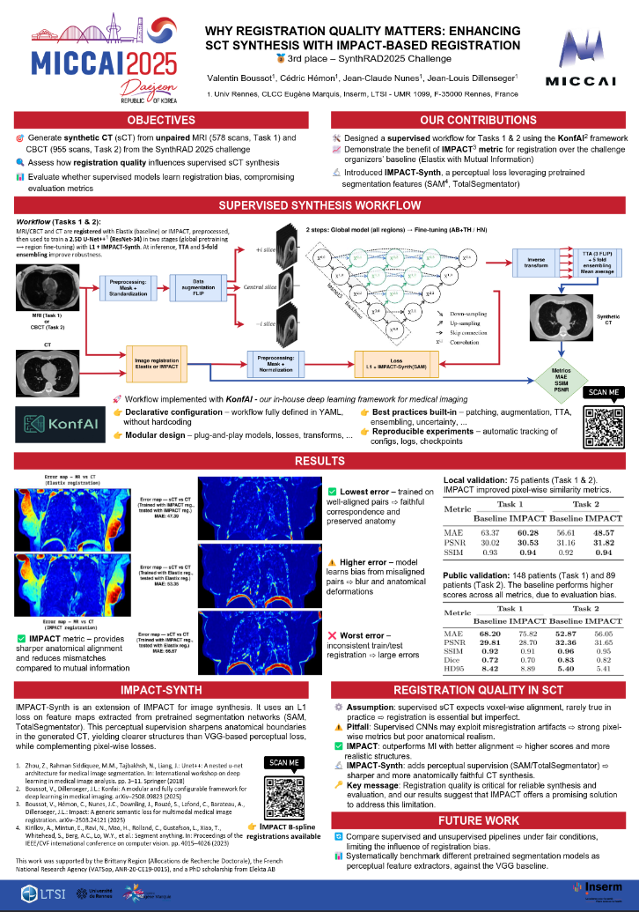

[](https://synthrad2025.grand-challenge.org/) [](https://huggingface.co/VBoussot/Synthrad2025)  [](./MICCAI_POSTER.pdf) [](https://arxiv.org/abs/2510.21358) [](https://huggingface.co/datasets/VBoussot/synthrad2025-impact-registration)
# SynthRAD2025 – Task 2 (🥉 3rd place)

This repository provides everything needed to build the Docker image and reproduce our solution ranked **3rd** in the **SynthRAD 2025 – Task 2** challenge on synthetic CT generation from CBCT.

Our approach is based on a **2.5D U-Net++** with a ResNet-34 encoder, trained in two phases:
- Phase 1: joint pretraining on all anatomical regions (AB, TH, HN)
- Phase 2: fine-tuning separately on **AB-TH** and **HN**

The method was implemented using [KonfAI](https://github.com/vboussot/KonfAI), our modular deep learning framework. Training combines pixel-wise L1 loss with **perceptual losses** derived from **SAM** features.

Final predictions use **test-time augmentation** and **5-fold ensembling**, with a total of **10 models**:  
**5 trained for Abdomen/Thorax (AB-TH)** and **5 for Head & Neck (HN)**.  
Models were selected based on validation MAE.

🏆 **3rd place overall** 
(Related leaderboard: [SynthRAD Task 2 leaderboard](https://synthrad2025.grand-challenge.org/evaluation/test-task-1-cbct/leaderboard/))


| Rank | MAE ↓             | PSNR ↑            | MS-SSIM ↑        | DICE ↑           | HD95 ↓           | Dose MAE photon ↓ | Dose MAE proton ↓ | DVH error photon ↓ | DVH error proton ↓ | GPR 2mm/2% photon ↑ | GPR 2mm/2% proton ↑ |
|------|-------------------|-------------------|------------------|------------------|------------------|-------------------|-------------------|---------------------|---------------------|----------------------|----------------------|
| 3    | 53.092 ± 17.347 (3)| 32.490 ± 2.292 (2)| 0.966 ± 0.025 (2)| 0.843 ± 0.079 (3)| 5.082 ± 3.359 (4)| 0.005 ± 0.004 (4) | 0.020 ± 0.014 (4) | 0.015 ± 0.019 (4)   | 0.036 ± 0.019 (2)   | 99.308 ± 1.102 (2)   | 86.407 ± 8.415 (4)   |

---

## 📐 Registration (IMPACT vs Baseline)

Accurate sCT synthesis depends on good **inter-modal alignment**. We provide **precomputed IMPACT registrations** (MR↔CT and CBCT↔CT) to ensure consistent training/evaluation.

### IMPACT setup used in this work
The following IMPACT configuration was used for **Task 2 (CBCT→CT synthesis)**:
- **Feature extractor:** TS/M730  
- **Layers:** 2-Layers (**Early layer**)  
- **Mode:** **Jacobian** 
- **Multi-resolution:** 3-level pyramid  
- **Final B-spline grid spacing:** **10 mm**

### Why it matters

- 🧭 **Alignment quality drives supervised sCT performance**
- 🧩 **IMPACT** → better anatomical alignment than **Elastix-MI**
  - Local set (75 pts): **MAE 56.61 → 48.57 HU**, ↑ PSNR / ↑ SSIM  
  - Sharper, more realistic CTs
- 📊 Public set (148 pts): **Elastix-MI lower MAE (52.87 vs 56.05 HU)**  
  → due to **pipeline bias** (leaderboard uses Elastix registrations)

### Get the registrations
- 👉 **Hugging Face (prealigned pairs):** https://huggingface.co/datasets/VBoussot/synthrad2025-impact-registration

---

## 🚀 Inference instructions

For more implementation details and a minimal working example, see the KonfAI synthesis example:  
https://github.com/vboussot/KonfAI/tree/main/examples/Synthesis

### 1. Install KonfAI

```bash
pip install "konfai[itk,smp]==1.8.7"
```

---

### 2. Download pretrained weights

Download the pretrained models from Hugging Face:

👉 https://huggingface.co/VBoussot/Synthrad2025

You should obtain:

```
Task_2/
├── AB-TH/
│   ├── CV_0.pt
│   ├── CV_1.pt
│   ├── CV_2.pt
│   ├── CV_3.pt
│   ├── CV_4.pt
│   └── Prediction.yml
│
└── HN/
    ├── CV_0.pt
    ├── CV_1.pt
    ├── CV_2.pt
    ├── CV_3.pt
    ├── CV_4.pt
    └── Prediction.yml
```

---

### 3. Dataset structure

Your dataset should be structured as follows:

```
./Dataset/
├── AB/
│   ├── 2ABA002/
│   │   ├── CBCT.mha
│   │   └── MASK.mha
│   ├── 2ABA003/
│   │   ├── CBCT.mha
│   │   └── MASK.mha
│   └── ...
├── TH/
│   └── ...
├── HN/
│   ├── 2HNA001/
│   │   ├── CBCT.mha
│   │   └── MASK.mha
│   └── ...
```

### 4. Run inference

Copy `UNetpp.py` next to your working directory — the prediction config references it through the
`UNetpp:` classpath:

```bash
cp KonfAI/UNetpp.py .
```

Your directory should then look like this:

    .
    ├── Dataset/
    ├── Task_2/            # weights + Prediction.yml (from Hugging Face)
    └── UNetpp.py

**AB-TH example:**

```bash
konfai PREDICTION -y --gpu 0 \
  --config Task_2/AB-TH/Prediction.yml \
  --models Task_2/AB-TH/CV_0.pt Task_2/AB-TH/CV_1.pt Task_2/AB-TH/CV_2.pt Task_2/AB-TH/CV_3.pt Task_2/AB-TH/CV_4.pt
```

For **Head & Neck**, use the HN config and weights:

```bash
konfai PREDICTION -y --gpu 0 \
  --config Task_2/HN/Prediction.yml \
  --models Task_2/HN/CV_0.pt Task_2/HN/CV_1.pt Task_2/HN/CV_2.pt Task_2/HN/CV_3.pt Task_2/HN/CV_4.pt
```

Predictions are written to `./Predictions/Out/Dataset/<case>/sCT.mha`.

> The Docker pipeline (`run.py`) performs exactly these steps automatically, routing each case to the
> AB-TH or HN model family based on the anatomical region.

---

## 📏 Evaluation

These are the models submitted to the challenge. They are trained on the pairs registered by the
organizers (Elastix), and the leaderboard scores the sCT against the planning CT **deformably registered to
the CBCT by the organizers**. Use that same reference on your own cases: a voxel-wise metric only means
something when the model and the reference CT follow the same registration.

Save the registered CT as `CT.mha` next to `CBCT.mha` and `MASK.mha`, then:

```bash
konfai EVALUATION -y --config KonfAI/Evaluation.yml
```

MAE, PSNR and SSIM inside the mask are written to `./Evaluations/Out/Metric_TRAIN.json`.

The public archives contain the planning CT, not the organizers' deformable result.
[RegistrationBias-sCT](https://github.com/vboussot/RegistrationBias-sCT) computes it with the organizers'
parameter files (`scripts/preprocessing/register_elx.py`) and provides the transforms of 169 public cases.

> Our models trained on IMPACT-registered pairs are a separate release,
> [TotalSynth / ImpactSynth](https://huggingface.co/VBoussot/ImpactSynth). Their reference is the planning CT,
> with the IMPACT-registered image as input; the two families are not evaluated the same way.

---
## 🛠️ How to Reproduce Training

> Training additionally requires TensorBoard: `pip install "konfai[itk,smp,tensorboard]==1.8.7"`.
> Run the commands from the repository root, with the model file next to it: `cp KonfAI/UNetpp.py .`
> The perceptual loss is `SAM_Perceptual` (SAM2.1 features); the `Statistics` transform on the CT
> target group feeds it the required intensity statistics.

Training is performed in **two phases**:

---

### 🔹 Phase 1 — Pretraining on all regions

Train a generic model on the full dataset (AB, TH, HN combined) (Fold 0 example):

```bash
konfai TRAIN -y --gpu 0 --config KonfAI/Plan/Phase_1/Config0.yml
```

---

### 🔹 Phase 2 — Region-specific fine-tuning

Fine-tune the Phase 1 model separately for each anatomical region.

#### Abdomen/Thorax (AB-TH) — Fold 0 example:

```bash
konfai RESUME -y --gpu 0 \
  --config KonfAI/Plan/Phase_2/AB-TH/Config0.yml \
  --model Phase1.pt
```

#### Head & Neck (HN) — Fold 0 example:

```bash
konfai RESUME -y --gpu 0 \
  --config KonfAI/Plan/Phase_2/HN/Config0.yml \
  --model Phase1.pt
```

> Replace `Phase1.pt` with the checkpoint from Phase 1 (best model from Fold 0).

## 📌 Poster presented at MICCAI 2025, Daejeon

[](./MICCAI_POSTER.pdf)
